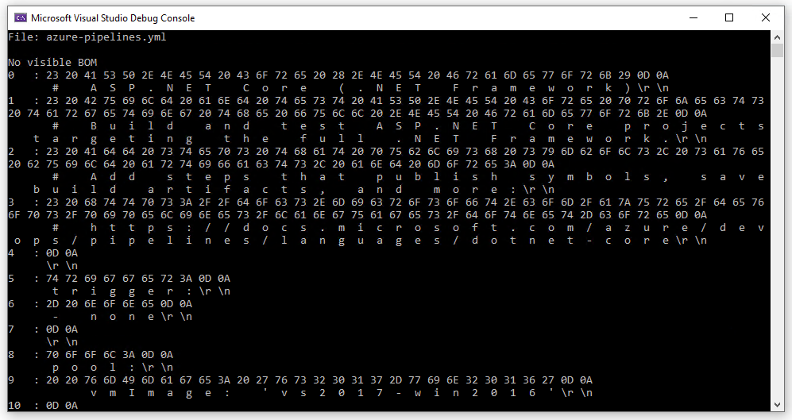

# FileOptics

This is a command line interface (cli) for looking at files and their bytes.



## Installation

This tool requires [Rust](https://www.rust-lang.org/tools/install) to be installed.

Since this crate isn't published yet, install it from the local path:

```
cargo install --path .
```

The tool will install globally and be accessible as `file_optics` on your command line.

## Usage

To get help run
```
file_optics -h | --help
```
